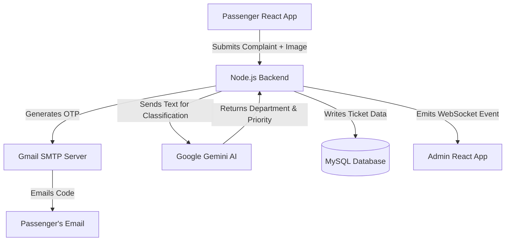

# 🚄 RailMadad — AI-Powered Railway Grievance Management Infrastructure

       

**RailMadad** is an enterprise-grade, full-stack clone of a public grievance portal. It completely modernizes the complaint pipeline by integrating **Google Gemini AI** as a silent backend routing engine to auto-categorize issues by department and priority, utilizing **Socket.io WebSockets** for real-time admin updates, and enforcing strict identity verification via a **custom Nodemailer SMTP pipeline** — all wrapped in a clean, minimal anti-slop UI.

---

## ✨ Key Features

### 🚄 For the Public (Passengers)
- **AI-Powered Auto-Routing:** Passengers describe their issue in plain text. A backend Google Gemini AI model processes the text to determine the exact railway department (out of 13) and assigns a priority level (`High`, `Medium`, `Low`) based on urgency (e.g., Medical/Fire = High).
- **True OTP Verification:** Complaints cannot be submitted blindly. The backend actively generates and sends a secure 6-digit OTP to the user's provided email address using Gmail SMTP.
- **Multipart Evidence Uploads:** Secure backend file handling (via `multer`) allows users to attach image evidence to their ticket.
- **Real-Time Tracking:** Passengers can look up their PNR/Mobile Number to view live ticket statuses, priority levels, and official remarks left by admins.
- **Automated Email Alerts:** The system actively emails passengers the exact moment an admin updates their ticket status.

### 🛡️ For the Administrators (Railway Staff)
- **Real-Time Command Center:** Powered by `Socket.io`. When a passenger submits a complaint anywhere, it instantly flashes onto the Admin Dashboard live—no page refreshes required.
- **JWT-Secured Gateway:** The `/admin` portal is locked behind secure JSON Web Token authentication.
- **Triage & Action System:** Admins can instantly identify high-priority tickets (highlighted in red), view AI reasoning confidence, inspect photo attachments, modify ticket statuses (Pending ➔ In Progress ➔ Resolved), and write internal remarks.

## 💻 Tech Stack

- **Frontend:** React 18, Vite, React Router v6, Tailwind CSS v4, Phosphor Icons.
- **Backend:** Node.js, Express.js.
- **Database:** MySQL (Relational Schema), `mysql2` connection pooling.
- **Real-Time & AI:** Socket.io (WebSockets), Google Gemini API (`@google/genai`).
- **Security & Mail:** `jsonwebtoken` (JWT), `nodemailer` (SMTP OTPs), `multer` (File Uploads).
- **DevOps:** Fully Dockerized (`Dockerfile`, `docker-compose.yml`).

## 🏗️ Architecture



## 🛠️ Installation & Setup

### Option 1: Docker (Recommended)
The fastest way to spin up the entire stack locally, including an automated MySQL server.

1. Clone the repository:
   ```bash
   git clone https://github.com/learner-sohit/Rail-Madad.git
   cd Rail-Madad
   ```
2. Set up your Environment Variables:
   ```bash
   cp .env.example .env
   ```
   *(Fill out the `.env` file with your Gemini API key and Gmail App Password).*
3. Run Docker Compose:
   ```bash
   docker compose up --build
   ```
4. Access the app:
   - Frontend: `http://localhost:8080`
   - Backend API: `http://localhost:3000`

### Option 2: Native Local Setup
If you want to run it without Docker (requires MySQL installed locally or a cloud database like Aiven/TiDB).

1. **Install Dependencies:**
   ```bash
   cd railmadad-backend && npm install
   cd ../railmadad-frontend && npm install
   ```
2. **Start Backend (from `railmadad-backend` folder):**
   ```bash
   npm start
   ```
   *(The backend automatically connects to your database and generates the tables via `ensureSchema`).*
3. **Start Frontend (from `railmadad-frontend` folder):**
   ```bash
   npm run dev
   ```

## 🔐 Environment Variables

You must create a `.env` file in the root directory. Use `.env.example` as a template.

| Variable | Description |
|---|---|
| `PORT` | Backend port (default: 3000) |
| `DB_HOST` | MySQL database host (e.g. localhost or Aiven URL) |
| `DB_PORT` | MySQL database port (e.g. 3306 or 10249) |
| `DB_USER` | MySQL database username |
| `DB_PASSWORD` | MySQL database password |
| `DB_NAME` | MySQL database name (default: defaultdb) |
| `DB_SSL` | Set to `true` if using a cloud DB like Aiven |
| `GEMINI_API_KEY` | Google AI Studio Key for classification |
| `ADMIN_USERNAME` | Custom username for the admin dashboard |
| `ADMIN_PASSWORD` | Custom password for the admin dashboard |
| `JWT_SECRET` | A secure random string for signing admin tokens |
| `SMTP_USER` | Your Gmail address (for sending OTPs) |
| `SMTP_PASS` | Your 16-character Google App Password (NO SPACES) |

## 📁 Repository Structure
```
Rail-Madad/
├── railmadad-frontend/         # React/Vite SPA
│   ├── src/pages/              # Page Routes (Home, Admin, File Complaint)
│   ├── src/features/           # Component modules
│   └── src/lib/api.js          # Axios client with JWT interceptor
├── railmadad-backend/          # Node/Express API
│   ├── src/controllers/        # Route Logic (Admin, Complaints)
│   ├── src/middlewares/        # Multer & JWT Auth Guards
│   ├── src/utils/              # Gemini AI & Nodemailer setup
│   └── src/server.js           # API Entrypoint
├── docker-compose.yml          # Container orchestration
└── .env                        # Root configuration
```

## 🤝 Contributing
Contributions are welcome! Please fork the repository, make your changes, and submit a pull request.
